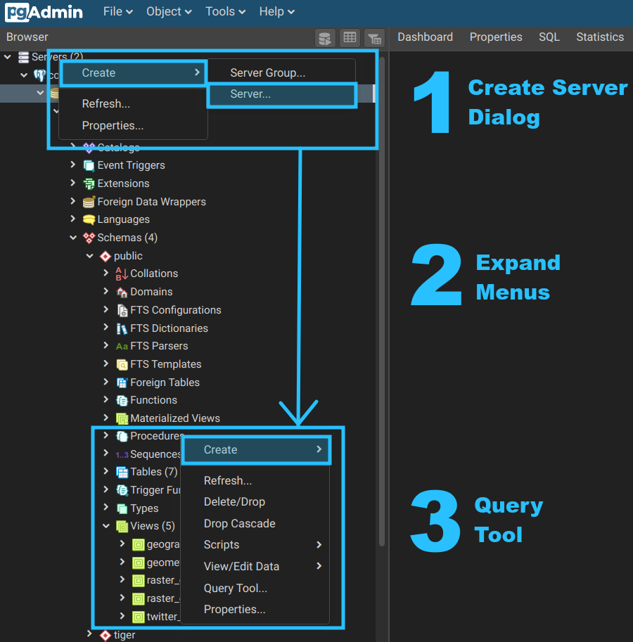

# covid19-data: Database Access Setup

* :cloud: [Available Datasets](README.md#available-datasets)
* :computer: [Database Interface](https://geocolab.ryerson.ca/db/pgadmin4)

Richard Wen rrwen.dev@gmail.com, Shishuo Xu shishuo.xu@ryerson.ca, Wei Huang huangweibuct@gmail.com

Database access setup instructions for the COVID-19 project.

## COVID19 Database

We have a `covid19` [PostgreSQL](https://www.postgresql.org/) database on our lab server that can be connected to remotely if you have the following connection details:

* **Host**: ip address of the database server
* **Port**: port of the database server
* **Database**: database name you are connecting to
* **User**: name of the user with access the database
* **Password**: password for the user

:mailbox: Please contact Richard Wen rrwen.dev@gmail.com for connection details.

## Database Interface

The easiest way to experiment with the data is to use the [Query Tool](https://www.pgadmin.org/docs/pgadmin4/latest/query_tool.html) from [pgAdmin4](https://www.pgadmin.org/) on our self-hosted **Database Interface** at: 

:link: [geocolab.ryerson.ca/db/pgadmin4](https://geocolab.ryerson.ca/db/pgadmin4).

Using an email and password setup, you can experiment with the [available data](README.md#available-datasets):

1. Create a connection using the [Server Dialog](https://www.pgadmin.org/docs/pgadmin4/latest/server_dialog.html)
2. View the data using the [various pgAdmin4 Tools](https://www.pgadmin.org/docs/pgadmin4/4.19/editgrid.html)
3. Run queries with the [Query Tool](https://www.pgadmin.org/docs/pgadmin4/latest/query_tool.html)

:mailbox: Please contact Richard Wen rrwen.dev@gmail.com for account setup.

## Programming Languages

Programming languages have their own interface that allow you to connect to a [PostgreSQL](https://www.postgresql.org/) database using either a package or a library.

To use programming language libraries or packages, you will need our COVID19 database connection details (see [here](#covid19-database)).

Once you have the connection details, you can use any programming language that supports [PostgreSQL](https://www.postgresql.org/) databases, such as:

* **Python**: [pandas Library](https://pandas.pydata.org/docs/) using [read_sql](https://pandas.pydata.org/pandas-docs/stable/reference/api/pandas.read_sql.html?highlight=read#pandas.read_sql)
* **R**: [RPostgres Package](https://rpostgres.r-dbi.org/) using [dbConnect](https://rpostgres.r-dbi.org/reference/dbconnect-pqdriver-method) and [dbSendQuery](https://rpostgres.r-dbi.org/reference/postgres-query.html)

