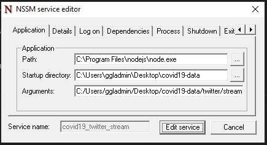
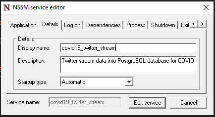
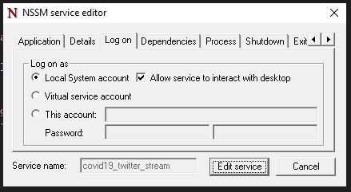
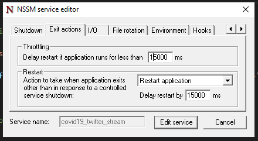
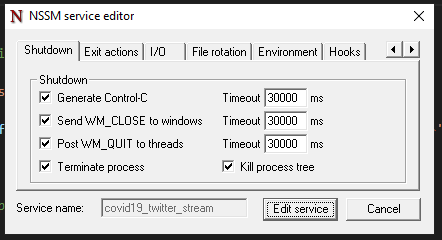
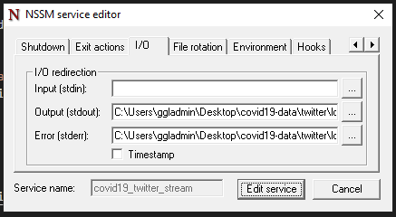

# covid19-data: Twitter Data Setup

* :page_facing_up: [Back to Details](README.md#twitter-data-stream)
  
Instructions for installing the required software to collect Twitter data for the COVID-19 project.

## Twitter Data Stream Service

The Twitter data stream will insert real-time COVID-19 related tweets filtered by keywords into a PostgreSQL database table.

* **Running on**: GGL-WORKSTATION
* **Database computer**: GGL-SERVER

Access via TeamViewer and pgadmin4 on the GGL-WORKSTATION.  
  
To install the Twitter data stream service, follow the instructions below.

## 1. Setting up the Twitter Stream

To collect streaming data from Twitter, we need to install the following:

1. Install [Node.js](https://nodejs.org/en/)
2. Install the [PostgreSQL Database](https://www.postgresql.org/)
3. Install the required `node` packages with `npm`
4. Create PostgreSQL database called `covid19`
5. Create a table in the database called `twitter_stream_raw` using the [twitter_stream_raw.sql](tables/twitter_stream_raw.sql) with [psql](https://www.postgresql.org/docs/current/app-psql.html) or [pgadmin4 Query Tool](https://www.pgadmin.org/docs/pgadmin4/development/query_tool.html)

```
npm install
```

**Note**: Ensure you are in the `covid19-data` folder 

## 2. Set Up the Environment File
  
After this, create a file called `.env` at the root of the `covid19-data` folder and fill in the following information:

```
TWITTER_CONSUMER_KEY=***
TWITTER_CONSUMER_SECRET=***
TWITTER_ACCESS_TOKEN_KEY=***
TWITTER_ACCESS_TOKEN_SECRET=***
PGHOST=localhost
PGUSER=postgres
PGPASSWORD=***
COMPUTER_NAME=REMOTE-COMPUTER-NAME
```

The Twitter CONSUMER and ACCESS keys/secret were provided by Wei.

## 3. Create a Twitter Data Stream Service
  
Now, install a Windows service with `nssm` called `covid19_twitter_stream` with the interface:

```
bin\nssm install covid19_twitter_stream
```

In the `Application` tab, apply the following settings:

* Set the `Path` to your node installation
* Set the `Startup Directory` to the `covid19-data` folder
* Set the `Arguments` the `twitter/stream.js` file with forward slashes `/`



Next, set the following settings in the `Details` tab:

* Change `Display Name` to `covid19_twitter_stream`
* Change `Description` to be `Twitter stream data into PostgreSQL database for COVID-19 tweets`
* Set `Startup type` to `Automatic (Delayed Start)`



For the `Log on` tab:

* Select the `This account` bullet
* Set `This account` to `GGL\ggladmin`
* Input the `password` twice in the two boxes



In the `Exit actions` tab, under `Restart`:

* Choose `Restart application`
* Set the `Delay restart if appication runs for less than` to `15000`
* Set the `Delay restart by` to `15000`



For the `Shutdown` tab:

* Set `Generate Ctrl+c` to `30000`
* Set `WM_CLOSE to windows` to `30000`
* Set `WN_QUIT to threads` to `30000`
* Keep `Terminate process` and `Kill process tree` checked



Finally, in the `I/O` tab:

* Set `Output (stdout)` and `Output (stderr)` to `twitter/logs/stream.log`
* Also create the `twitter/logs` folder if it does not exist



All other settings are left on default.

### 4. Run the Twitter Data Stream Service

Run the `covid19_twitter_stream` service we installed from the previous step with:

```
bin\nssm start covid19_twitter_stream
```

Checking on the service:

```
bin\nssm status covid19_twitter_stream
```

If you need to stop this service:

```
bin\nssm stop covid19_twitter_stream
```

If you need to make changes to the service:

```
bin\nssm edit covid19_twitter_stream
```

A log is created at `twitter/logs/stream.log`.

### 5. Create User Views from twiter_stream_raw

The `twitter_stream_raw` table contains a mix of tweet JSON objects and any message objects returned from the Twitter streaming API.  
  
This means that the table needs to be cleaned into a tabular format for any real research or development use.  
  
A set of SQL files for database views are available to create more clean versions of the `twitter_stream_raw` table, which can be run in [psql](https://www.postgresql.org/docs/current/app-psql.html) or through the [pgadmin4 Query Tool](https://www.pgadmin.org/docs/pgadmin4/development/query_tool.html):

* [twitter_stream.sql](views/twitter_stream.sql): view of only tweets and retweets from `twitter_stream_raw`

These views are kept updated as the stream adds in new data, and provides you with the latest up-to-date at the time you run a query against these views.
